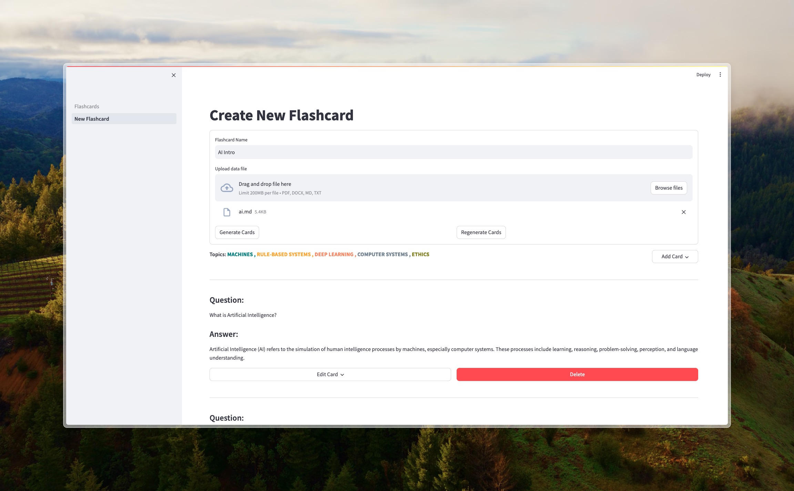
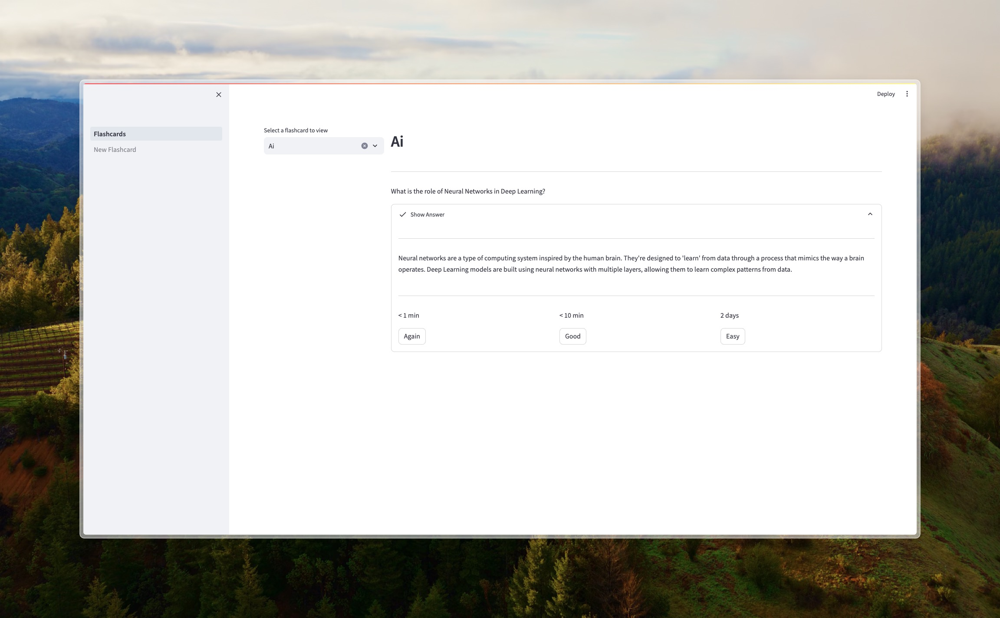

# Median: Your Ultimate Learning Companion 🚀

Say goodbye to cramming last minute and hello to efficient learning with Median! This flashcard app is designed to supercharge your learning experience using the power of spaced repetition. Whether
you're a student, educator, or lifelong learner, Median has got you covered with its advanced algorithms to help you remember information longer and more reliably.





## Awesome Features ✨

**📚 Dynamic Flashcard Creation:** Import your learning materials directly from PDF, DOCX, Markdown, and text files and watch Median magically transform them into flashcards.

**🧠 Smart Spaced Repetition:** With the scientifically proven Ebisu algorithm, Median tailors your review schedules to match your personal learning pace, optimizing memory retention like never before.

**🎮 Automated Quizzes:** Put your knowledge to the test with quizzes generated from your flashcards. Reinforce your learning and make studying fun!

**📊 Interactive Learning Dashboard:** Keep track of your progress with our intuitive web interface that adapts to your learning needs.

## Getting Started: Rocket Launch 🚀

### Installation

1. **Clone the Repository**

   ```sh
      git clone https://github.com/5uru/Median.git
      cd Median
   ```
2. **Install Dependencies**

   ```sh
      pip install -r requirements.txt
   ```
3. **Download requirements**

   ```sh
      python download.py
   ```

### Running the Application

Blast off to an exciting learning journey by executing:

```sh
       streamlit run Flashcards.py
```

## How to Use Median: Your Learning Mission 🌟

* **Adding Flashcards:** Head to "Add New Flashcard" to upload your study materials and let Median work it's magic by automatically generating flashcards.
* **Reviewing Flashcards:** Pick a set to review. Median will schedule your flashcard reviews based on your learning performance, ensuring you stay on top of your game.

## What's Next for Median: Future Galactic Updates 🌌

1. [ ] **Advanced Analytics Dashboard:** A more detailed analytics section where users can track their learning progress over time, identify areas that need more focus, and receive personalized
   learning recommendations.

2. [ ] **Improved Document Processing:** Enhanced capability to handle diverse document formats and extract information more accurately, with potential integration of advanced NLP and ML models for
   better context understanding and flashcard generation.

3. [ ] **Custom Learning Paths:** Users can create personalized learning paths based on their goals, timelines, or specific topics they want to master, with adaptive learning algorithms tailoring the
   difficulty and pacing.

4. [ ] **Social Learning Features:** Functionality for users to share flashcards, collaborate on quiz creation, or challenge each other in knowledge battles, introducing competitive and social
   learning elements.
5. [ ] **Installable App:** A standalone desktop or mobile app version of Median for offline learning and better performance.

Join the Median community today and embark on an exciting learning adventure! 🚀✨